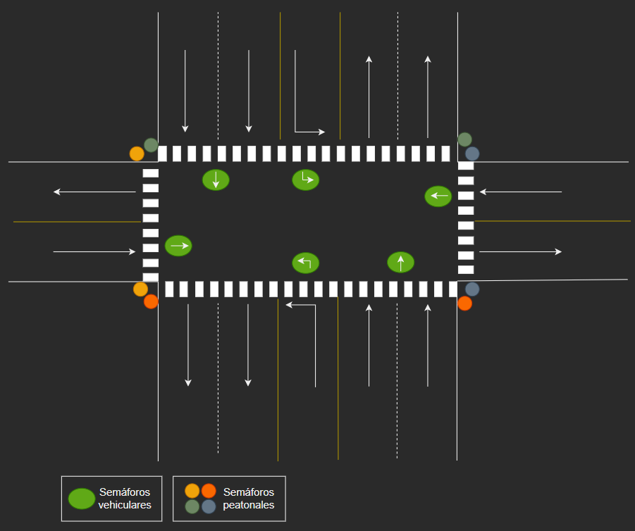
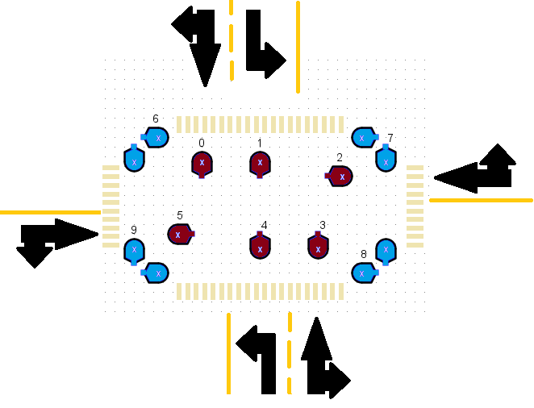

# Diseño de Circuito de Semáforos

NOTA: De momento se espera tener esto listo antes del 11 de Junio, con el 8 de Junio como fecha optimista de pre-entrega.

## Lineamientos de implementación

Los lineamientos podrán cambiar durante el transcurso de las diversas fases del proyecto. Por favor no esperar que el contenido de este documento sea estático, y mantenerse vigilante de algún cambio a su contenido en cada Pull Request.

* Hacer buen uso de los commits y su mensaje. Se trabajará en español hasta donde sea factible/razonable. Por favor documentar **siempre** en voz *pasiva* o *imperativa*, dependiendo del caso.

* Escribir nombres de circuito en minúsculas, en español, con palabras separadas por espacios. Sin tildes. Para los nombres de *branch*, usar guión bajo ("_") para separar las palabras. Siempre sin tildes.

* Intentar respetar la escala de los circuitos existentes, en cuanto a espacio entre componentes (i.e. largo de cables).

#### Diseño de la intersección

#### Posición de los semáforos

#### Leyenda de Rutas por Fase

Todos los semáforos peatonales presentan una pareja, por lo cual sólo van numerados una vez.

<table>
<tr><td>

| Fase (Vehicular) | Semáforos |
|------------------|-----------|
| 0                | 0,1       |
| 1                | 2,5       |
| 2                | 3,4       |
| Fase (Peatonal)  | Semáforos |
| 3                | 5,6       |
| 4                | 0,7       |
| 5                | 2,8       |
| 6                | 3,9       |

</td><td>

| Semáforo | Número de conexiones |
|----------|----------------------|
| 0        | 2                    |
| 1        | 1                    |
| 2        | 2                    |
| 3        | 2                    |
| 4        | 1                    |
| 5        | 2                    |
| 6        | 1                    |
| 7        | 1                    |
| 8        | 1                    |
| 9        | 1                    |

</td></tr> </table>

#### Controlador (de) Botones

* Entrada: Direcciones de 32 bits al primer elemento del arreglo de entrada y al primer elemento del arreglo de salida.
* El controlador se ve reducido, en esta fase, a un programa que al correr revisa si uno de cuatro bytes en un arreglo en memoria es diferente a cero. De ser así, cambia todos los valores en un arreglo de salida a cero, y luego cambia el valor en el arreglo de salida de misma posición que el valor que es diferente a cero en el arreglo de entrada. Luego, cambia todos los valores del arreglo de entrada a cero.

#### Codificadores

* Entrada: Direcciones de 32 bits al primer elemento del arreglo de entrada/salida y al primer elemento del arreglo de salida/entrada.
* Los codificadores, dependiendo de su dirección, convierten a/desde una dirección de byte única en memoria, que representa un valor único binario, desde/a un arreglo de bytes en memoria de tamaño *k*, para representar los *k* diferentes estados de entrada/salida.

#### Validador

* Entrada: Direcciones de 32 bits al primer elemento del arreglo de entrada, al primer elemento del arreglo de salida y a los elementos DUPL y WRITE.
* El validador consiste en un programa que compara el valor en un arreglo de entrada de dos bytes en memoria con el valor en un arreglo de salida de dos bytes en memoria. Si los valores son iguales, cambia una dirección de byte en memoria *(DUPL)* a uno, si no son iguales, la cambia a cero. Además, existe otra dirección de byte en memoria como banderín de escritura *(WRITE)*. Si el banderín de escritura es diferente de cero, escribe los valores de entrada al arreglo de salida.

#### Enrutador

* La funcionalidad del enrutador se ha visto absorbida por la interfaz gráfica.

#### Semáforos

* La funcionalidad de los semáforos se ha visto absorbida por la interfaz gráfica.
