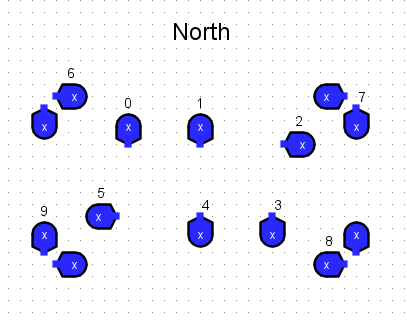
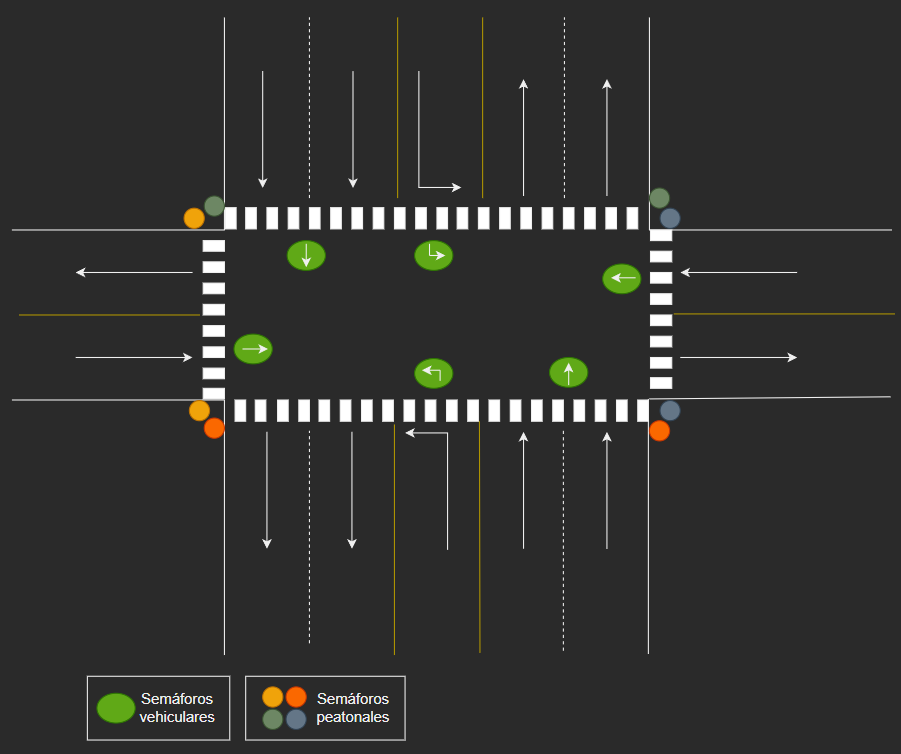

### Leyenda de Rutas por Fase

Todos los semáforos peatonales presentan una pareja, por lo cual sólo van numerados una vez.

| Fase (Vehicular) | Semáforos |
|------------------|-----------|
| 0                | 0,1       |
| 1                | 2         |
| 2                | 4,3       |
| 3                | 5         |
| Fase (Peatonal)  | Semáforos |
| 4                | 5,6       |
| 5                | 0,7       |
| 6                | 2,8       |
| 7                | 3,9       |

